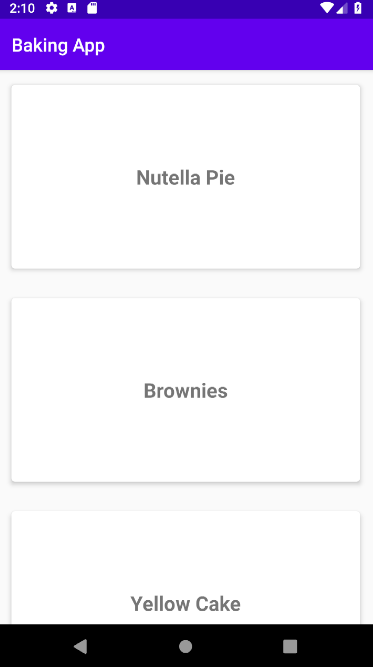
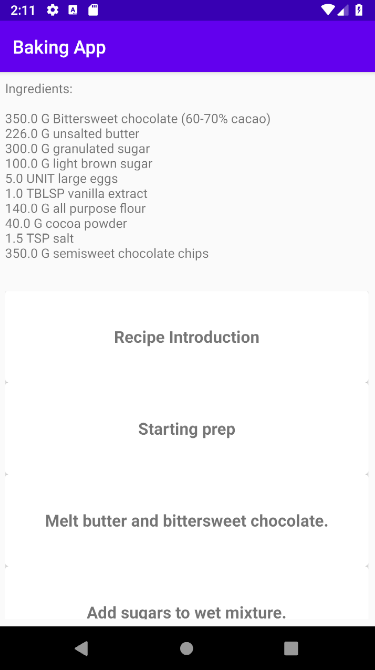
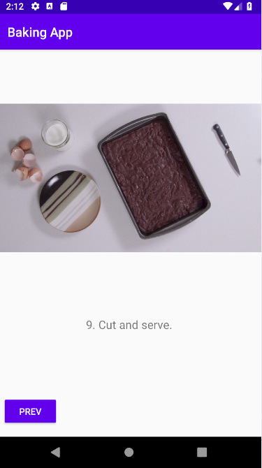

# baking-app
Displays various baking recipes. Users can select a recipe and see video-guided steps for how to complete it.
Both phones and tablets are supported.

This app uses the Retrofit library to retrieve online recipes. 
It also uses version 3.12.0 of the OkHttp library to support backwards compatibility on older devices below Android 5.0 (API 21).

## Installation
If you have Git and Android Studio installed, use:
```
git clone https://github.com/mdhsieh/baking-app.git
```
to clone this repository.
Then go to your cloned folder and import it in Android Studio.
Run the app.

## Screenshots


